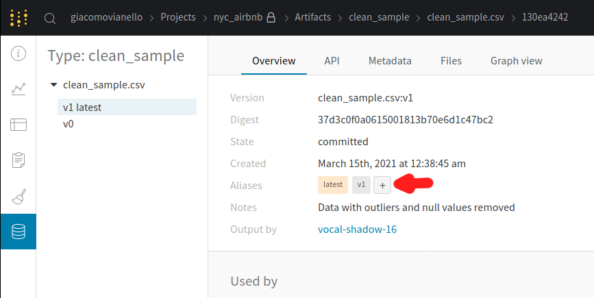

# Build-an-ML-pipeline-for-short-term-rental-prices-in-NYC
=======
# Build an ML Pipeline for Short-Term Rental Prices in NYC
We are working for a property management company renting rooms and properties for short periods of time on various rental platforms We need to estimate the typical price for a given property based on the price of similar properties.
The company receives new data in bulk every week. The model needs to be retrained with the same cadence, necessitating an end-to-end pipeline that can be reused.

In this project we will build such a pipeline.

- [Introduction](#build-an-ML-Pipeline-for-Short-Term-Rental-Prices-in-NYC)
  * [Create environment](#create-environment)
  * [Get API key for Weights and Biases](#get-api-key-for-weights-and-biases)
  * [The configuration](#the-configuration)
  * [Running the entire pipeline or just a selection of steps](#Running-the-entire-pipeline-or-just-a-selection-of-steps)
  * [Exploratory Data Analysis (EDA)](#exploratory-data-analysis-eda)
  * [Data cleaning](#data-cleaning)
  * [Data testing](#data-testing)
  * [Data splitting](#data-splitting)
  * [Train Random Forest](#train-random-forest)
  * [Optimize hyperparameters](#optimize-hyperparameters)
  * [Select the best model](#select-the-best-model)
  * [Test](#test)
  * [Visualize the pipeline](#visualize-the-pipeline)
  * [Release the pipeline](#release-the-pipeline)
  * [Train the model on a new data sample](#train-the-model-on-a-new-data-sample)
- [Cleaning up](#cleaning-up)


### Create environment
Make sure to have conda installed and ready, then create a new environment using the ``environment.yml``
file provided in the root of the repository and activate it:

```bash
> conda env create -f environment.yml
> conda activate nyc_airbnb_dev
```
### Get API key for Weights and Biases
Let's make sure we are logged in to Weights & Biases. Get your API key from W&B by going to 
[https://wandb.ai/authorize](https://wandb.ai/authorize) and click on the + icon (copy to clipboard), 
then paste your key into this command:

```bash
> wandb login [your API key]
```

You should see a message similar to:
```
wandb: Appending key for api.wandb.ai to your netrc file: /home/[your username]/.netrc
```
### The configuration
As usual, the parameters controlling the pipeline are defined in the ``config.yaml`` file defined in
the root of the starter kit. We will use Hydra to manage this configuration file. 
Remember: this file is only read by the ``main.py`` script 
(i.e., the pipeline) and its content is
available with the ``go`` function in ``main.py`` as the ``config`` dictionary. For example,
the name of the project is contained in the ``project_name`` key under the ``main`` section in
the configuration file. It can be accessed from the ``go`` function as 
``config["main"]["project_name"]``.

NOTE: It is NOT recommended to hardcode any parameter when writing the pipeline. All the parameters should be 
accessed from the configuration file.

### Running the entire pipeline or just a selection of steps
In order to run the pipeline when you are developing, you need to be in the root of the starter kit, 
then you can execute as usual:

```bash
>  mlflow run .
```
This will run the entire pipeline.

When developing it is useful to be able to run one step at the time. Say you want to run only
the ``download`` step. The `main.py` is written so that the steps are defined at the top of the file, in the 
``_steps`` list, and can be selected by using the `steps` parameter on the command line:

```bash
> mlflow run . -P steps=download
```
If you want to run the ``download`` and the ``basic_cleaning`` steps, you can similarly do:
```bash
> mlflow run . -P steps=download,basic_cleaning
```
You can override any other parameter in the configuration file using the Hydra syntax, by
providing it as a ``hydra_options`` parameter. For example, say that we want to set the parameter
modeling -> random_forest -> n_estimators to 10 and etl->min_price to 50:

```bash
> mlflow run . \
  -P steps=download,basic_cleaning \
  -P hydra_options="modeling.random_forest.n_estimators=10 etl.min_price=50"
```

### Exploratory Data Analysis (EDA)
The scope of this section is to get an idea of how the process of an EDA in the context of
pipelines, during the data exploration phase. 

1. Run the pipeline to 
   get a sample of the data. The pipeline will also upload it to Weights & Biases:
   
  ```bash
  > mlflow run . -P steps=download
  ```
  
  You will see a message similar to:

  ```
  2021-03-12 15:44:39,840 Uploading sample.csv to Weights & Biases
  ```
  This tells you that the data is going to be stored in W&B as the artifact named ``sample.csv``.

2. Now we execute the `eda` step:
   ```bash
   > mlflow run src/eda
   ```
   This will install Jupyter and all the dependencies and open a Jupyter notebook instance.
   
3. Within the notebook, we fetch the artifact we just created (``sample.csv``) from W&B and read 
   it with pandas:
    
    ```python
    import wandb
    import pandas as pd
    
    run = wandb.init(project="nyc_airbnb", group="eda", save_code=True)
    local_path = wandb.use_artifact("sample.csv:latest").file()
    df = pd.read_csv(local_path)
    ```
    Note that we use ``save_code=True`` in the call to ``wandb.init`` so the notebook is uploaded and versioned
    by W&B.

## Data cleaning

Now we transfer the data processing we have done as part of the EDA to a new ``basic_cleaning`` 
step that starts from the ``sample.csv`` artifact and create a new artifact ``clean_sample.csv`` 
with the cleaned data:
1. Created our new MlFlow project which contain 3 files run.py, conda.yml, and MlProject

2. then we modify the ``src/basic_cleaning/run.py`` script and the ML project script by filling 
   the missing information about parameters.
   
3. We use ``args.min_price`` and ``args.max_price`` when dropping the outliers 
   (instead of hard-coding the values).
   we then save the results to a CSV file called ``clean_sample.csv`` 
   (``df.to_csv("clean_sample.csv", index=False)``)
   **_NOTE_**: Remember to use ``index=False`` when saving to CSV, otherwise the data checks in
               the next step might fail because there will be an extra ``index`` column
   
   Then upload it to W&B using:
   
   ```python
   artifact = wandb.Artifact(
        args.output_artifact,
        type=args.output_type,
        description=args.output_description,
    )
    artifact.add_file("clean_sample.csv")
    run.log_artifact(artifact)
   ```
   
   **_REMEMBER__**: Whenever we are using a library (like pandas), we MUST add it as 
                    dependency in the ``conda.yml`` file. For example, here we are using pandas 
                    so we must add it to ``conda.yml`` file, including a version:
   ```yaml
   dependencies:
     - pip=20.3.3
     - pandas=1.2.3
     - pip:
         - wandb==0.10.31
   ```
   
4.then we add the ``basic_cleaning`` step to the pipeline (the ``main.py`` file):

   **_WARNING:_**: please note how the path to the step is constructed: 
                   ``os.path.join(hydra.utils.get_original_cwd(), "src", "basic_cleaning")``.
   This is necessary because Hydra executes the script in a different directory than the root
   of the starter kit. we will have to do the same for every step we are going to add to the 
   pipeline.
   
   **_NOTE_**: Remember that when we refer to an artifact stored on W&B, we MUST specify a 
               version or a tag. For example, here the ``input_artifact`` should be 
               ``sample.csv:latest`` and NOT just ``sample.csv``. If we forget to do this, 
               we will see a message like
               ``Attempted to fetch artifact without alias (e.g. "<artifact_name>:v3" or "<artifact_name>:latest")``

   ```python
   if "basic_cleaning" in active_steps:
       _ = mlflow.run(
            os.path.join(hydra.utils.get_original_cwd(), "src", "basic_cleaning"),
            "main",
            parameters={
                "input_artifact": "sample.csv:latest",
                "output_artifact": "clean_sample.csv",
                "output_type": "clean_sample",
                "output_description": "Data with outliers and null values removed",
                "min_price": config['etl']['min_price'],
                "max_price": config['etl']['max_price']
            },
        )
   ```
5. After running the pipeline. If we go to W&B, we will see the new artifact type `clean_sample` and within it there is an 
   `clean_sample.csv` artifact

### Data testing
After the cleaning, it is a good practice to put some tests that verify that the data does not
contain surprises. 

One of our tests will compare the distribution of the current data sample with a reference, 
to ensure that there is no unexpected change. Therefore, we first need to define a 
"reference dataset". We will just tag the latest ``clean_sample.csv`` artifact on W&B as our 
reference dataset. In browser to ``wandb.ai``, navigate to our `nyc_airbnb` project, then to the
artifact tab. Click on "clean_sample", then on the version with the ``latest`` tag. This is the
last one we produced in the previous step. We add a tag ``reference`` to it by clicking the "+"
in the Aliases section on the right:


 
Now we are ready to add some tests. In the below file test_data.py contain our test code 
``src/data_check/test_data.py`` perform the following test:
  
```python
def test_row_count(data):
    assert 15000 < data.shape[0] < 1000000
```
which checks that the size of the dataset is reasonable (not too small, not too large).

Then, we add another test ``test_price_range(data, min_price, max_price)`` that checks that 
the price range is between ``min_price`` and ``max_price`` 

Now we add the `data_check` component to the main file, so that it gets executed as part of our
pipeline. we use ``clean_sample.csv:latest`` as ``csv`` and ``clean_sample.csv:reference`` as 
``ref``. Right now they point to the same file, but later on they will not: we will fetch another sample of data
and therefore the `latest` tag will point to that. 
Also, we use the configuration for the other parameters. For example, 
``config["data_check"]["kl_threshold"]`` for the ``kl_threshold`` parameter. 

Then we run the pipeline and make sure the tests are executed and that they pass. Remember that we can run the data test component by using the below command.

```bash
> mlflow run . -P steps="data_check"
```

### Data splitting
We use our next component called ``train_val_test_split`` to extract and segregate the test set. 
then we add it to the pipeline as a part of workflow. As usual, we use the configuration for the parameters like `test_size`,
`random_seed` and `stratify_by`. all this configuration available in `modeling` section in the config file.

**_HINT_**: The path to the step can
be expressed as ``mlflow.run(f"{config['main']['components_repository']}/train_val_test_split", ...)``.

We can see the parameters accepted by this step [here](https://github.com/udacity/build-ml-pipeline-for-short-term-rental-prices/blob/main/components/train_val_test_split/MLproject)

After executing the component, we will see something like:

```
2021-03-15 01:36:44,818 Uploading trainval_data.csv dataset
2021-03-15 01:36:47,958 Uploading test_data.csv dataset
```
in the log. This will us tell us that the script is uploading 2 new datasets: ``trainval_data.csv`` and ``test_data.csv``.

### Train Random Forest
Now we run the script ``src/train_random_forest/run.py``. 
the first thing that we do is pass the random_forest section available in the ``config.yaml`` file to the ``run.py`` file.

then we fetch the training dataset artifact from wandb using the below command and create our input and target features.

```
trainval_local_path = run.use_artifact(args.trainval_artifact).file()
X = pd.read_csv(trainval_local_path)
y = X.pop("price")  # this removes the column "price" from X and puts it into y
```
After training and scoring the model we now save our model to a temporary random_forest_dir which will be deleted after uploading this diirectory to weights & biases. 

```
signature = infer_signature(X_val[processed_features],y_pred)
    
    with tempfile.TemporaryDirectory() as temp_dire:
        export_path = os.path.join(temp_dire,"random_forest_dir")
        mlflow.sklearn.save_model(
            sk_pipe,
            export_path,
            serialization_format=mlflow.sklearn.SERIALIZATION_FORMAT_CLOUDPICKLE,
            signature = signature,
            input_example=X_val.head()
        )        
```
we now upload this model artifact to Weights & Biases and one important note here we are uploading a directory instead a file that's why we ``.add_dir `` instead of ``.add_file``

```
Artifact = wandb.Artifact(
    args.output_artifact,
    type="ml_model",
    description="our random forest ML model",
    metadata=rf_config
)

Artifact.add_dir(export_path)
run.log_artifact(Artifact)

Artifact.wait()

```
We also log our metrics just we use below r2 score and mean_absolute_error
```
    run.summary['r2'] = r_squared
    run.summary["mae"] = mae

    run.log(
        {
          "feature_importance": wandb.Image(fig_feat_imp),
        }
    )

```

Once you are done, add the step to ``main.py``. we use the name ``random_forest_export`` as ``output_artifact``.

**_NOTE_**: the main.py file already provides a variable ``rf_config`` to be passed as the
            ``rf_config`` parameter.

